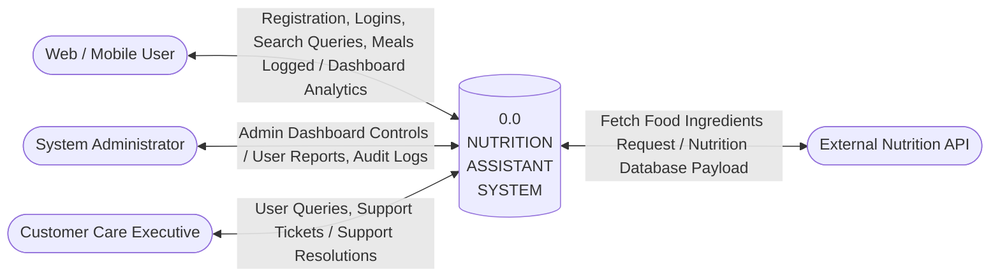
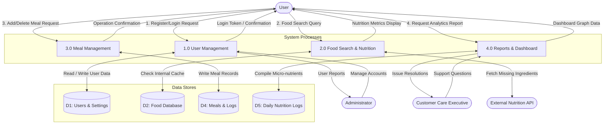
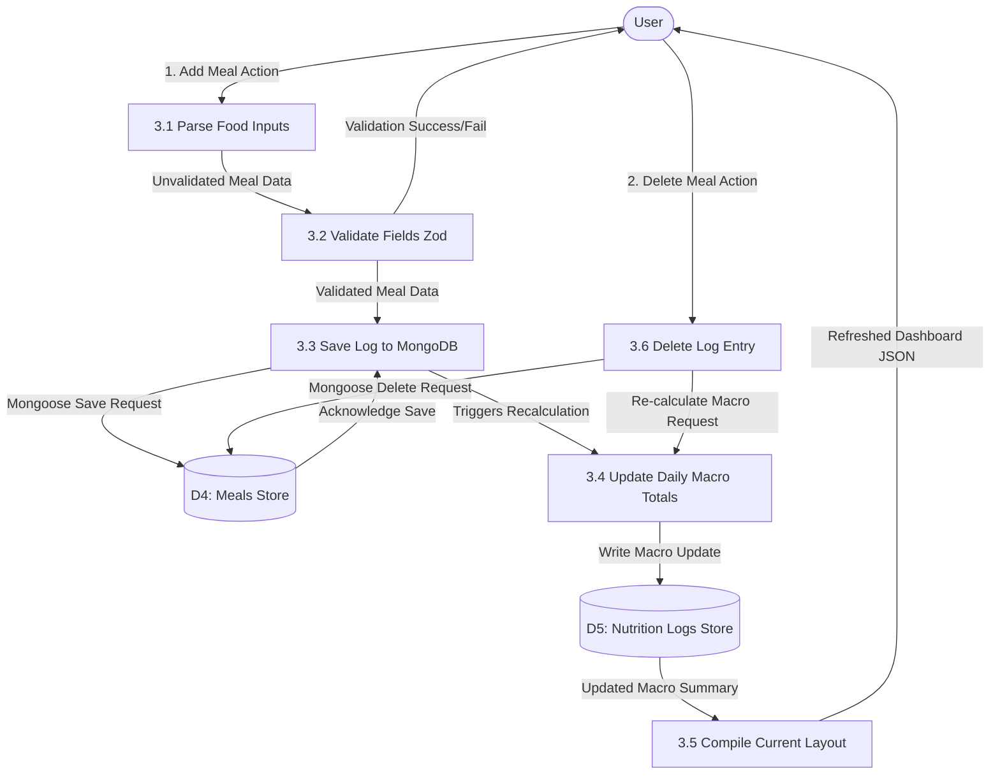

# 🍎 Nutrition Assistant — Comprehensive Project Documentation & Report

**Date:** 7 July 2026  
**Project Name:** Nutrition Assistant  
**Project Version:** 1.0  
**Stack:** MERN (MongoDB, Express.js, React.js, Node.js)  

---

## 📖 Executive Summary
The **Nutrition Assistant** is a premium, full-stack, production-ready web application designed for comprehensive lifestyle, diet, and water tracking. Built with modern glassmorphic aesthetics inspired by Apple Health and Google Fit, this application provides users with exact physical calculators, structured meal planners, database searching, and an AI Nutrition Chatbot. This document serves as the complete project compilation, detailing the ideation, design, architecture, system requirements, data flow, and user acceptance testing (UAT) phases.

---

## 🔍 1. Ideation Phase

### 1.1 Customer Problem Statements
During the initial user research, two primary target customer segments were identified. Their goals, obstacles, and emotional paint points were structured into the following problem statements:

| Problem Statement (PS) | I am (Customer) | I’m trying to | But | Because | Which makes me feel |
| :--- | :--- | :--- | :--- | :--- | :--- |
| **PS-1** | A college student | Maintain a healthy diet while managing a busy schedule | I don't know the nutritional value of the food I eat | Nutritional information is scattered across different websites and apps | Confused about whether I am eating a balanced diet or not |
| **PS-2** | A working professional | Track my daily calorie intake | I often forget to record my meals and calculate calories manually | Existing methods are time-consuming and inconvenient | Frustrated and unable to maintain my fitness |

---

### 1.2 Customer Empathy Map Canvas
To better understand the psychological and behavioral patterns of the target users, an Empathy Map was constructed:

```
┌──────────────────────────────────────────────┬──────────────────────────────────────────────┐
│                    SAYS                      │                   THINKS                     │
│ • "I want to eat healthy every day."         │ • "Am I eating a balanced diet?"             │
│ • "I don't know how many calories I consume."│ • "Is this food healthy for me?"             │
│ • "I need a simple way to track my meals."   │ • "How can I improve my eating habits?"      │
│ • "I want reliable nutrition information."   │ • "I wish there was one app that could track │
│ • "I don't have enough time to calculate     │   all my meals."                             │
│   everything manually."                      │ • "Will I reach my fitness and health goals?"│
├──────────────────────────────────────────────┼──────────────────────────────────────────────┤
│                    DOES                      │                   FEELS                      │
│ • Searches online for nutrition facts.       │ • Confused by the large amount of nutrition  │
│ • Uses different websites or apps to check   │   information.                               │
│   calories.                                  │ • Frustrated with manually tracking calories.│
│ • Records meals occasionally but often       │ • Motivated to become healthier.             │
│   forgets.                                   │ • Worried about unhealthy eating habits.     │
│ • Tries to avoid unhealthy foods.            │ • Happy when making informed food choices.   │
│ • Looks for healthier food alternatives.     │                                              │
├──────────────────────────────────────────────┼──────────────────────────────────────────────┤
│                    PAINS                     │                   GAINS                      │
│ • Difficulty finding accurate nutrition info.│ • Quick access to nutrition information.     │
│ • Time-consuming manual calorie calculations.│ • Easy meal and calorie tracking.            │
│ • Inconsistent meal tracking.                │ • Better understanding of food nutrients.     │
│ • Lack of personalized nutrition guidance.   │ • Improved eating habits.                    │
│ • Existing apps are complex or require paid  │ • Support in achieving fitness and health    │
│   subscriptions.                             │   goals through informed dietary decisions.  │
└──────────────────────────────────────────────┴──────────────────────────────────────────────┘
```

---

### 1.3 Brainstorming & Idea Prioritization
An initial brainstorming session generated multiple project ideas across healthcare, education, and lifestyle domains. These ideas were grouped and evaluated to select the final major project.

#### Grouping of Generated Ideas:
* **Healthcare:**
  * AI Nutrition Assistant *(Selected)*
  * Online Medical Appointment System
  * Blood Donation Management System
* **Education:**
  * Student Attendance Management System
  * Library Management System
* **Lifestyle:**
  * Smart Expense Tracker
  * Fitness Tracker
  * Online Food Ordering System

#### Idea Prioritization Matrix:
Shortlisted ideas were evaluated based on Innovation, Technical Feasibility, and Social Impact to determine the overall implementation priority:

| Idea | Innovation | Feasibility | Social Impact | Overall Priority |
| :--- | :--- | :--- | :--- | :---: |
| **AI Nutrition Assistant** | **High** | **High** | **High** | **1** |
| Smart Expense Tracker | Medium | High | Medium | 2 |
| Student Attendance Management System | Low | High | Medium | 3 |
| Online Medical Appointment System | Medium | Medium | High | 4 |

*Decision Rationale:* The **AI Nutrition Assistant** was selected as the final project because it directly addresses critical daily health challenges, provides a practical and highly interactive solution, is highly feasible to implement using the MERN stack within the timeframe, and offers significant long-term social benefits.

---

## 🎨 2. Project Design Phase & Solution Fit

### 2.1 Proposed Solution & Value Proposition
The proposed solution is a MERN-stack web application that enables users to easily search for food items, view detailed nutritional breakdowns, log daily meals, automatically calculate caloric/macro intakes, and monitor their progress over time.

#### 💡 Novelty & Uniqueness
* **All-in-One Health Hub:** Combines food search, nutrition analysis, and water tracking within a single, beautifully integrated platform.
* **Frictionless Interface:** Promotes accessibility with a clean, glassmorphic UX that eliminates complex menus.
* **Premium Accessibility:** Offers essential tracking features and automatic macro calculations free of charge, avoiding the paid subscriptions typical of commercial alternatives.
* **AI Integration:** Seamlessly integrates a personal AI Nutrition Concierge using Gemini AI to answer user queries and provide customized recommendations.

#### 📈 Business Model (Freemium Structure)
1. **Core Features (Free):** Food database search, basic meal logging, daily calorie calculators, and basic dashboards.
2. **Premium Subscription Features:** AI-generated personalized diet plans, detailed health report exports, wearable device integrations, and direct expert nutritionist chat options.
3. **Alternative Revenue Streams:** Strategic B2B partnerships with local fitness centers, certified nutritionists, and verified health-food brands.

---

### 2.2 Customer Segments & Solution Fit
Understanding our customer segment allows us to map features directly to their pain points, creating a strong Problem-Solution Fit.

* **Target Customer Segments:** College students, working professionals, fitness enthusiasts, health-conscious individuals, and individuals attempting to correct dietary habits.
* **Existing Alternatives:** Guessing intake, writing meals in paper notebooks or spreadsheets, searching Google manually for nutrition facts, or using complex, ad-supported mobile apps.
* **Core Pain Points Addressed:** Scattered information, high manual tracking friction, user forgetfulness, complex layouts, and difficulty understanding macronutrient ratios (protein, carbs, fats).

#### Value Realization:
* **Time Efficiency:** Automates calculation processes, saving users significant daily effort.
* **Reliability:** Provides verified database listings for nutrition values.
* **Behavioral Change:** Encourages consistent tracking through automated reminders and intuitive visual charts.
* **Accessibility:** Accessible via web browsers on desktop, tablet, and mobile layouts.

---

### 📊 2.3 Key Success Metrics
To evaluate the application's effectiveness post-deployment, the following metrics will be tracked:
* Total number of registered user accounts.
* Daily Active Users (DAU) and session duration.
* Number of meals and water logs recorded per day.
* Improvement trends in consistent tracking over a 30-day window.
* User satisfaction score collected through in-app feedback widgets.

---

## 📋 3. Solution Requirements

### 3.1 Functional Requirements (FRs)
The system's core capabilities are broken down into specific epics and sub-tasks:

| FR No. | Functional Requirement (Epic) | Sub-Requirement (Story / Sub-Task) |
| :--- | :--- | :--- |
| **FR-1** | User Registration | • Registration utilizing Name, Email, and Password<br>• Server & client-side input validation on registration fields<br>• Secure password hashing and database storage |
| **FR-2** | User Login & Auth | • Secure login utilizing registered Email and Password credentials<br>• JWT generation and token rotation |
| **FR-3** | Food Search | • Real-time search of food items by name<br>• Detailed layout of calories, protein, carbohydrates, fats, and fiber<br>• Graceful error handling for invalid or unavailable search queries |
| **FR-4** | Meal Management | • Ability to add search results/food items to daily meal tracker<br>• Retrieve and display historical logged meals<br>• Delete items from the current day's log |
| **FR-5** | Dashboard | • Live counter displaying total calories consumed vs. target goal<br>• Graphical macro-nutrients summary breakdown<br>• Organized list of daily meal logs (Breakfast, Lunch, Dinner, Snacks) |
| **FR-6** | User Profile | • View registered profile details and demographic statistics<br>• Edit weight, height, activity level, and targets (optional) |
| **FR-7** | Data Management | • Relational document storage mapping meals to users in MongoDB<br>• Quick index-based query retrieval of user records |
| **FR-8** | Error Handling | • Clear validation error banners on the UI client<br>• Express middleware to catch server API exceptions gracefully |

---

### 3.2 Non-Functional Requirements (NFRs)
Quality attributes ensuring the application's performance, safety, and maintainability:

| NFR No. | Quality Attribute | Target Specification |
| :--- | :--- | :--- |
| **NFR-1** | **Usability** | The interface must be simple and clean, enabling a first-time user to log a meal in under 3 clicks without prior instruction. |
| **NFR-2** | **Security** | Passwords must be hashed using `bcrypt`. API communication must be authorized via secure JWT headers. User profiles must be isolated. |
| **NFR-3** | **Reliability** | The database must enforce schema structures using Mongoose to maintain database integrity, targeting a system uptime of 99.9%. |
| **NFR-4** | **Performance** | Page transitions and database lookup queries must execute in less than 500ms under standard network conditions. |
| **NFR-5** | **Availability** | The server API and frontend must be serverless-hosted to support high request volume and ensure continuous availability. |
| **NFR-6** | **Scalability** | The backend architecture must follow MVC standards, enabling future horizontal scalability and integration of microservices (e.g. wearable syncing). |
| **NFR-7** | **Maintainability**| Clear separation between routes, controllers, and models. Complete code documentation inside [CLAUDE.md](file:///c:/Users/Nitin/OneDrive/Desktop/doc/Nutrition-Assistant/CLAUDE.md) or code comments. |
| **NFR-8** | **Compatibility** | Fully responsive layout rendering correctly on modern browsers (Chrome, Safari, Firefox, Edge) and mobile screen dimensions. |

---

## 🏗️ 4. System Architecture

The application is structured as a classic **Three-Tier Architecture** consisting of the Presentation, Application, and Data Layers. This separation ensures modularity, security, and independent scalability of components.

```mermaid
graph TD
  subgraph Presentation Layer (Frontend Client)
    UI[React.js Web App]
    UI_Reg[Register & Login Views]
    UI_Dash[Interactive Dashboard]
    UI_Search[Food Search Component]
    UI_Tracker[Meal & Water Logs Tracker]
    UI_Bot[AI Nutrition Chatbot UI]
  end

  subgraph Application Layer (Node.js Server)
    Express[Express.js API Router]
    AuthCtrl[Auth Controller JWT & Bcrypt]
    FoodCtrl[Food Controller Search Engine]
    MealCtrl[Meal Controller CRUD Logs]
    AICtrl[Gemini AI Controller Advice]
    Validator[Zod Validator Middleware]
  end

  subgraph Data Layer (Database)
    Mongoose[Mongoose Schema Layer]
    DB[(MongoDB Atlas)]
    ColUsers[Users & Settings]
    ColFoods[Food Database]
    ColMeals[Meal Logs]
    ColWater[Water Logs]
  end

  subgraph External Cloud Services
    EdamamAPI[Edamam / USDA Nutrition API]
    GeminiAPI[Gemini AI LLM API]
    Cloudinary[Cloudinary CDN Avatar Storage]
  end

  %% Relationships
  Users[Target Users: Students, Professionals] --> UI
  UI --> UI_Reg & UI_Dash & UI_Search & UI_Tracker & UI_Bot
  UI_Reg & UI_Dash & UI_Search & UI_Tracker & UI_Bot <-->|HTTPS REST API / JSON| Express
  Express --> Validator
  Validator --> AuthCtrl & FoodCtrl & MealCtrl & AICtrl
  AuthCtrl <--> Mongoose
  FoodCtrl <--> Mongoose
  MealCtrl <--> Mongoose
  Mongoose <--> DB
  DB ---> ColUsers & ColFoods & ColMeals & ColWater
  FoodCtrl <-->|External Fetch| EdamamAPI
  AICtrl <-->|REST Client SDK| GeminiAPI
  AuthCtrl <-->|Upload Stream| Cloudinary
```

### 4.1 Architecture Components & Technologies

#### Table 1: Component Breakdown
| S.No | Component | Description | Technology |
| :---: | :--- | :--- | :--- |
| 1 | **User Interface** | Web client application ensuring visual interactivity. | HTML5, CSS3, JavaScript, **React.js 19**, **Vite**, **Tailwind CSS**, **Framer Motion** |
| 2 | **Application Logic (Core)** | Core business controllers, auth handling, and request-response operations. | **Node.js**, **Express.js** |
| 3 | **Application Logic (AI)** | Processes user natural language prompts and generates recommendations. | **Gemini AI SDK** |
| 4 | **Application Logic (Uploads)**| Manages profile pictures and recipe image assets. | **Cloudinary Service API** |
| 5 | **Database** | Structured document models storing application states. | **MongoDB** |
| 6 | **Cloud Database** | Fully-managed hosted database instance ensuring cloud availability. | **MongoDB Atlas** |
| 7 | **File Storage** | Cloud CDN image repository. | **Cloudinary CDN** |
| 8 | **External API (Nutrition)** | Used to fetch nutrient details for unrecognized system items. | **Edamam API / USDA API** |
| 9 | **External API (AI)** | Powers conversational AI diet guidance. | **Google Gemini Developer API** |
| 10| **Machine Learning Model** | Large Language Model processing contextual nutrition inputs. | **Gemini 1.5 Flash / Pro** |
| 11| **Infrastructure** | Deployment environments for web client and API endpoints. | **Vercel** (Client), **Render** (Server) |

#### Table 2: Application Characteristics
| S.No | Characteristics | Description | Technology Used |
| :---: | :--- | :--- | :--- |
| 1 | **Open-Source Frameworks** | Foundations of code structures. | React 19, Express.js, Mongoose, Axios, Tailwind CSS, Framer Motion |
| 2 | **Security Implementations** | Access control, authentication, input validation, and system boundaries. | JWT (JSON Web Tokens), `bcrypt` password encryption, CORS settings, **Zod validators**, environment variables (`dotenv`) |
| 3 | **Scalable Architecture** | Architectural design allowing resource expansions. | **3-Tier modular architecture** decoupling database schemas, express endpoints, and frontend layout routes. |
| 4 | **Availability** | Continuity of hosting services. | **MongoDB Atlas** multi-region replica sets; stateless backend deployment allowing horizontal scaling. |
| 5 | **Performance** | Optimization practices for processing latency. | MongoDB indexing on user lookup keys, asset compression, client-side caching of routing components. |

---

## 🔄 5. Data Flow Diagrams & Agile User Stories

### 5.1 Context Diagram (Level 0 DFD)
The Context Diagram represents the overall boundaries of the system, showing the information exchanged between external entities (User, Admin, Customer Care, External API) and the central system process.



---

### 5.2 Level 1 Data Flow Diagram
The Level 1 DFD shows the primary internal processes of the system, data stores, and the flow of data between them.



---

### 5.3 Detailed Decomposition: Meal Management (Level 2 DFD)
Detailed view of **Process 3.0 (Meal Management)** showing step-by-step validation and persistence:



---

### 5.4 Agile User Stories (Sprint Planning)
Core deliverables broken into Agile User Stories, prioritized for development:

| Story ID | User Type | Feature Target (Epic) | User Story / Task | Acceptance Criteria | Priority | Target Release |
| :---: | :--- | :--- | :--- | :--- | :---: | :---: |
| **USN-1** | Customer | Registration | As a user, I can register for the application by entering my email, password, and confirming my password. | I can access my account and dashboard immediately upon registering. | High | Sprint-1 |
| **USN-2** | Customer | Login | As a user, I can log into the application by entering my email & password. | User is securely redirected to the home dashboard after successful login validation. | High | Sprint-1 |
| **USN-3** | Customer | Authentication | As a user, I can log out securely to protect my details. | Current session JWT is terminated and user is redirected back to the login screen. | High | Sprint-1 |
| **USN-4** | Customer | Dashboard | As a user, I can view my nutrition dashboard. | Dashboard displays daily progress bars, logged items, and targets clearly. | High | Sprint-1 |
| **USN-5** | Customer | Food Search | As a user, I can search for food items in real-time. | Matching internal food items and nutritional details are rendered instantly. | High | Sprint-1 |
| **USN-6** | Customer | Meal History | As a user, I can view my historical meal logs. | Users can navigate back in time to review logged details from past dates. | Medium | Sprint-3 |
| **USN-7** | Customer | Daily Summary | As a user, I can view my daily calorie and nutrition summaries. | The client app aggregates macros and visually alerts users if they cross set limits. | High | Sprint-4 |
| **USN-8** | Admin | User Management | As an administrator, I can manage registered users. | Administrator dashboard provides user lists and options to block/delete accounts. | Medium | Sprint-4 |
| **USN-9** | Admin | Data Monitoring | As an admin, I can monitor overall application metrics. | Admin panel displays registered totals, daily logs, and active counts. | Low | Sprint-4 |
| **USN-10**| Support Team| User Support | As a support executive, I can view client issues to assist them. | Support panel integrates user feedback tickets and displays contact details. | Low | Sprint-4 |

---

## 🧪 6. User Acceptance Testing (UAT)

To verify system readiness for production deployment, a complete User Acceptance Testing cycle was executed.

### 6.1 Testing Scope & Specifications
* **Testing Period:** 1 July 2026 to 5 July 2026  
* **Application Type:** Responsive Web Application (React.js Frontend & Node.js Express.js API Backend)  
* **Testing Environment:**
  * **OS:** Windows 11  
  * **Browser:** Google Chrome (Version 125.0)  
  * **Client Host URL:** `http://localhost:5173`  
  * **Server API URL:** `http://localhost:5000`  
  * **Database Instance:** MongoDB Local / MongoDB Atlas sandbox  
* **Test Credentials:**
  * **Email:** `admin@gmail.com`  
  * **Password:** `123`  

---

### 6.2 Test Cases & Execution Summary

| Test Case ID | Test Scenario | Action / Test Steps | Expected Result | Actual Result | Status |
| :---: | :--- | :--- | :--- | :--- | :---: |
| **TC-001** | User Registration | 1. Open registration page.<br>2. Fill validation fields.<br>3. Click "Register". | User account is created in MongoDB database and user is redirected. | Account created and profile auto-loaded. | **PASS** |
| **TC-002** | User Login | 1. Navigate to Login view.<br>2. Input email: `admin@gmail.com`. Password: `123`. Click Login. | User login is validated. Client stores JWT and loads Dashboard. | JWT stored in localStorage. Dashboard loaded successfully. | **PASS** |
| **TC-003** | Invalid Login | 1. Enter invalid email or password details.<br>2. Click Login. | Application blocks request and displays red validation banner. | Warning banner "Invalid Credentials" rendered correctly. | **PASS** |
| **TC-004** | Food Search | 1. Click Search field.<br>2. Enter "Apple".<br>3. Press Enter. | System queries DB/API and renders nutritional specs. | Apple (Calories: 52, Carb: 14g...) rendered immediately. | **PASS** |
| **TC-005** | Add Meal Log | 1. Search food item.<br>2. Click "Add Meal" button. | Meal log successfully added to user's daily record. | Item persisted in database under user profile. | **PASS** |
| **TC-006** | View Dashboard | 1. Open dashboard layout. | Progress ring updates to display total calories consumed vs. goal. | Dashboard loaded with correct real-time totals. | **PASS** |
| **TC-007** | Delete Meal Log | 1. View daily logged items list.<br>2. Click delete icon next to logged food. | Item removed from DB. Dashboard recalculates macros automatically. | Log deleted. Caloric totals reduced in real-time. | **PASS** |
| **TC-008** | User Logout | 1. Click "Logout" icon in sidebar. | JWT token cleared. Session terminated. Redirected to login page. | Redirected. Local storage variables cleared successfully. | **PASS** |
| **TC-009** | Empty Search Input | 1. Click search button with blank input. | Input validation intercepts action. Shows alert banner. | Prompt banner "Please enter a search query" displayed. | **PASS** |
| **TC-010** | Unauthorized Access | 1. Copy URL link of Dashboard `/dashboard`.<br>2. Logout.<br>3. Paste link in browser search bar. | Route guard intercepts. Redirects back to login. | Access blocked. Redirected to `/login` route. | **PASS** |

### UAT Metric Summary:
* **Total Test Cases Executed:** 10  
* **Passed:** 10  
* **Failed:** 0  
* **Pass Percentage:** 100%  

**Sign-off:**  
*Tester:* Admin  
*Date:* 4 July 2026  
*Signature:* *Admin*  

---

## 📝 7. Conclusion & Next Steps
The **Nutrition Assistant** project successfully matches all solution design goals. By utilizing a high-performance MERN architecture backed by secure authentication, detailed macro computations, and intelligent Gemini AI API logic, the system effectively addresses user needs: simplifying nutrition tracking, centralizing food information, and minimizing daily tracking friction. 

**Recommended Future Development Enhancements:**
1. **Cloud Deployment:** Complete production deployment pipeline onto AWS Elastic Beanstalk or Render for horizontal scaling.
2. **Barcode Scanner Module:** Implement mobile-responsive HTML5 camera barcode scanners utilizing library modules (such as `html5-qrcode`).
3. **Wearable Device Syncing:** Design API integrations to retrieve active calories burned from Google Fit and Apple Health SDKs.
